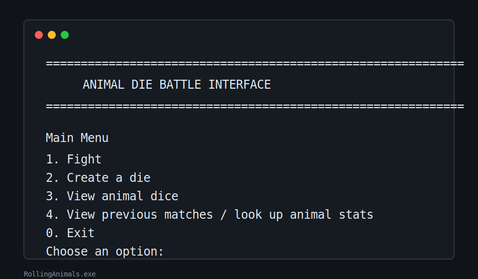

# Rolling Animals

Rolling Animals terminal game where players can create custom animal dice, battle them in best-of-three matches, and track each animal's long-term record.


## Project Links

- Repository: [DevinOLacey/Rolling-Animals](https://github.com/DevinOLacey/Rolling-Animals)

## Features

- Create animal dice with six custom side values.
- Save and load animal dice from `ZooBox.txt`.
- Battle two animals in a best-of-three match.
- Add optional magic dice effects, including modifier, transform, and opponent-focused effects.
- Record match history in `Results.txt`.
- Track animal records, game wins/losses, series wins/losses, and average roll in `AnimalRecords.txt`.
- View saved animals, previous matches, and individual animal statistics from the main menu.

## Build and Run

This project is built for Windows with `g++`. Install MinGW/MSYS2 or another C++17 compiler and make sure `g++` is available on your PATH before running the build script.

```bat
build.bat
```

The build script compiles the main game executable:

- `RollingAnimals.exe`

Run the game:

```bat
RollingAnimals.exe
```

## File Overview

- `main.cpp` - terminal menu, gameplay flow, animal battles, and stats views
- `FileStorage.cpp` / `FileStorage.h` - save/load helpers and file validation
- `dice.cpp` / `dice.h` - base die behavior
- `AnimalDie.cpp` / `AnimalDie.h` - animal die model
- `MagicDice.cpp` / `MagicDice.h` - base magic die behavior
- `ModDie.h`, `TransDie.h`, `OppDice.h` - specific magic die effects
- `tests_interface_io.cpp` - automated checks for file/interface behavior
- `ZooBox.txt` - saved animal dice
- `Results.txt` - match history
- `AnimalRecords.txt` - aggregate animal stats
